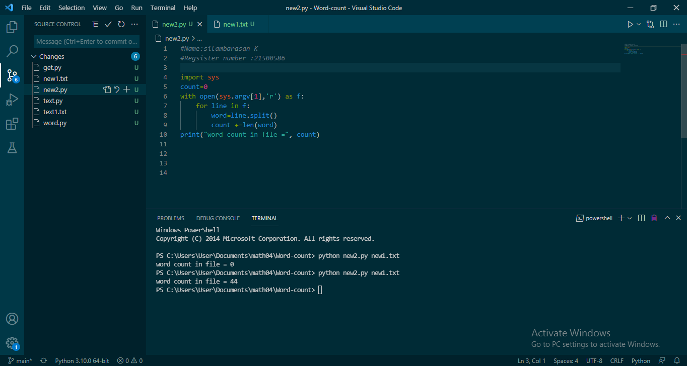
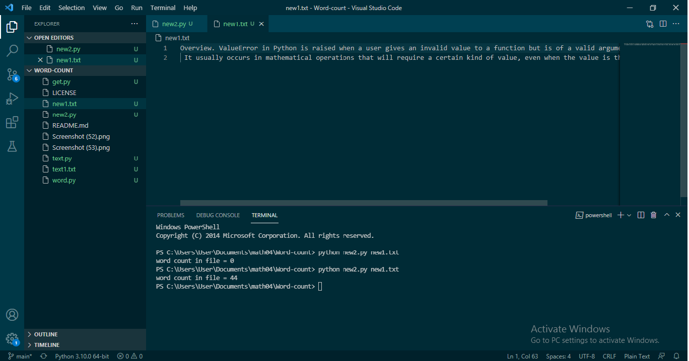

# command-line-arguments-to-count-word
## AIM:
To write a python program for getting the word count from the contents of a file using command line arguments.
## EQUIPEMENT'S REQUIRED: 
PC
Anaconda - Python 3.7
## ALGORITHM: 
### Step 1: Create a python file  with .py and text file .txt

### Step 2: In python file import sys 

### Step 3:  Assign a variable count =0 and open a file in read mode

### Step 4:  iterate a variable(lines) through the file

### Step 5: Assign a variable words = lines.split()

### Step 6: Now iterate through the variable and increase the count: and print the count value

## PROGRAM:
```
NAME: silambarasan K
REGSISTER NUMBER:21500586
import sys
count=0
with open(sys.argv[1],'r') as f:
    for line in f:
        word=line.split()
        count +=len(word)
print("word count in file =", count)
```
### OUTPUT:




## RESULT:
Thus the program is written to find the word count from the contents of a file using command line arguments.
